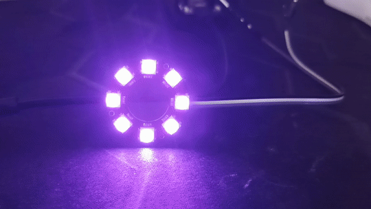

# EspIDF_LedRing
Testing Out an RGB LED ring.

### Dependencies
  - espressif/led_strip: "^2.3.0"
  - espressif/led_indicator: "^0.3.0"

Dont mind the name of the main file...

---

### Breathing effect

### Bounce Animation

.gif)